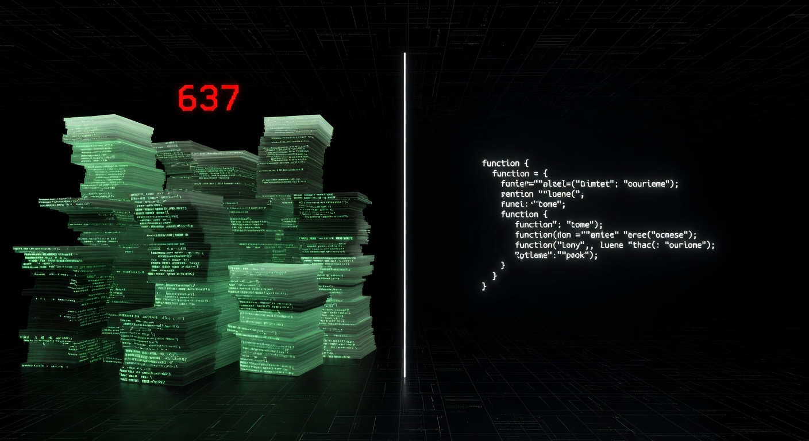
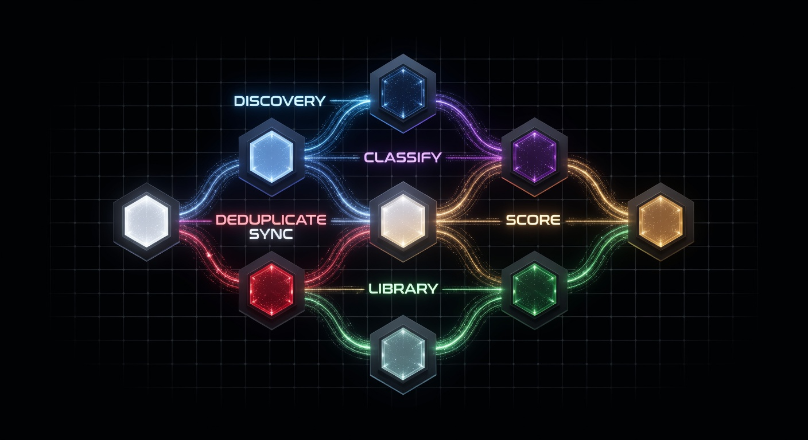

# echo-drive-scanner

```
┌─────────────────────────────────────────────────────────────────────────────┐
│                                                                             │
│    ███████╗ ██████╗ █████╗ ███╗   ██╗███╗   ██╗███████╗██████╗            │
│    ██╔════╝██╔════╝██╔══██╗████╗  ██║████╗  ██║██╔════╝██╔══██╗           │
│    ███████╗██║     ███████║██╔██╗ ██║██╔██╗ ██║█████╗  ██████╔╝           │
│    ╚════██║██║     ██╔══██║██║╚██╗██║██║╚██╗██║██╔══╝  ██╔══██╗           │
│    ███████║╚██████╗██║  ██║██║ ╚████║██║ ╚████║███████╗██║  ██║           │
│    ╚══════╝ ╚═════╝╚═╝  ╚═╝╚═╝  ╚═══╝╚═╝  ╚═══╝╚══════╝╚═╝  ╚═╝           │
│                                                                             │
│              Intelligent Drive Scanner — Echo Omega Prime                  │
│                                                                             │
└─────────────────────────────────────────────────────────────────────────────┘
```


<p align="center">
  
  &nbsp;
  
</p>


*In 2025 the average developer's machine held somewhere between 500,000 and 2,000,000 files across a dozen drives. Nobody knew what was on them. Duplicates multiplied silently. Critical code was copy-pasted until it lived in 637 places simultaneously. Config files held credentials no one remembered putting there. This scanner was built to end that era. It looks at every file, understands what it is, scores it, finds its copies, and tells you exactly what to do about it. — Echo Omega Prime, March 2026*

---

**Intelligent Drive Scanner** is a production-grade, AI-powered filesystem intelligence engine. It walks your entire drive, classifies every file through a 3-tier pipeline, scores each one across 6 dimensions, maps duplicates, extracts reusable code functions system-wide, scans for secrets, and pushes everything to a live Cloudflare analytics worker — all while streaming results in real time.

Built as the foundation intelligence layer for [Echo Omega Prime](https://github.com/bobmcwilliams4/echo-prime-tech), a sovereign multi-agent AI platform.

---

## What it does

```
  Your drives
  ┌─────────────────────────────────────────────────────────┐
  │  O:\  (767K files)  Z:\  (1.7K files)  I:\  (docs)    │
  └────────────────────┬────────────────────────────────────┘
                       │  walk + hash + sample
                       ▼
  ┌─────────────────────────────────────────────────────────┐
  │  PHASE 1 — DISCOVERY                                    │
  │  • Recursive walk with priority queue                   │
  │  • MIME detection (python-magic)                        │
  │  • xxHash + SHA-256 per file                           │
  │  • Change detection — skip unchanged files             │
  │  • Disk preflight — abort if DB drive < 5GB free       │
  └────────────────────┬────────────────────────────────────┘
                       │
                       ▼
  ┌─────────────────────────────────────────────────────────┐
  │  PHASE 2 — CLASSIFICATION  (3-tier engine)             │
  │                                                         │
  │  Tier 1 ── Extension + MIME → domain bucket            │
  │            PYTHON / TYPESCRIPT / CLOUDFLARE / AUDIO    │
  │            CREDENTIALS / CONFIG / LEGAL / MEDIA ...    │
  │                                                         │
  │  Tier 2 ── Content sample (8KB) → pattern matching     │
  │            API keys · import graphs · framework IDs    │
  │                                                         │
  │  Tier 3 ── Full content analysis                       │
  │            AST parsing · schema extraction             │
  │            Secret scanning · credential references     │
  └────────────────────┬────────────────────────────────────┘
                       │
                       ▼
  ┌─────────────────────────────────────────────────────────┐
  │  PHASE 3 — SCORING  (6 dimensions, 0–100 each)         │
  │                                                         │
  │  quality_score      — code quality, completeness        │
  │  importance_score   — centrality, reference count       │
  │  sensitivity_score  — credentials, PII, secrets         │
  │  staleness_score    — last modified vs access pattern   │
  │  uniqueness_score   — inverse of copy_count             │
  │  risk_score         — combined sensitivity + staleness  │
  └────────────────────┬────────────────────────────────────┘
                       │
                       ▼
  ┌─────────────────────────────────────────────────────────┐
  │  PHASE 4 — FUNCTION LIBRARY                            │
  │                                                         │
  │  Every .py / .js / .ts file → AST extraction          │
  │  Stored: name · signature · body · quality_score       │
  │          copy_count (how many files share this fn)     │
  │          design_pattern · language · file_path         │
  │                                                         │
  │  Result: queryable library of every function           │
  │  system-wide — find what to refactor, what to reuse   │
  └────────────────────┬────────────────────────────────────┘
                       │
                       ▼
  ┌─────────────────────────────────────────────────────────┐
  │  PHASE 5 — DEDUPLICATION                               │
  │                                                         │
  │  Exact     — matching xxHash clusters                  │
  │  Near       — similar content fingerprints             │
  │  Semantic   — same purpose, different name             │
  │                                                         │
  │  Output: cluster_hash · file_count · wasted_bytes      │
  └────────────────────┬────────────────────────────────────┘
                       │
                       ▼
  ┌─────────────────────────────────────────────────────────┐
  │  PHASE 6 — RECOMMENDATIONS + WORKER SYNC               │
  │                                                         │
  │  Actionable intelligence — ranked by severity          │
  │  Streamed to Cloudflare Worker D1 in 500-file batches  │
  │  Live dashboard on localhost:8460                      │
  └─────────────────────────────────────────────────────────┘
```

---

## Numbers (production run, Alpha node)

| Metric | Value |
|--------|-------|
| Files indexed | **1,413,743** |
| Scans completed | 26 |
| Duplicate clusters found | 2,099 |
| Intelligence scores computed | 300,784 |
| Project proposals generated | 1,449 |
| Recommendations surfaced | 34 |
| Scan profiles | 5 |

---

## The Function Library

The most powerful feature. Every scan populates 8 queryable tables:

```
┌──────────────────┬────────────────────────────────────────────────────┐
│ lib_functions    │ name · signature · body · quality_score ·          │
│                  │ copy_count · language · file_path                   │
├──────────────────┼────────────────────────────────────────────────────┤
│ lib_patterns     │ design patterns: circuit_breaker · rate_limiter ·  │
│                  │ singleton · factory · observer · pipeline           │
├──────────────────┼────────────────────────────────────────────────────┤
│ lib_schemas      │ Pydantic models · TypedDict · SQLite tables        │
│                  │ TypeScript interfaces                               │
├──────────────────┼────────────────────────────────────────────────────┤
│ lib_endpoints    │ Express routes · FastAPI decorators · Hono routes  │
├──────────────────┼────────────────────────────────────────────────────┤
│ lib_prompts      │ system_prompt vars · {role:system} chat blocks     │
├──────────────────┼────────────────────────────────────────────────────┤
│ lib_configs      │ ALL_CAPS constants · os.environ · process.env refs │
├──────────────────┼────────────────────────────────────────────────────┤
│ lib_errors       │ try/except handlers · catch blocks                 │
├──────────────────┼────────────────────────────────────────────────────┤
│ sensitive_findings│ files with actual credential patterns detected    │
└──────────────────┴────────────────────────────────────────────────────┘
```

**Real example — query that triggered the Echo SDK project:**

```sql
SELECT name, copy_count FROM lib_functions
WHERE copy_count > 10
ORDER BY copy_count DESC
LIMIT 10;
```

```
__init__              |  637
health_check          |  637
_build_headers        |  637
_calculate_quality_score | 637
shutdown              |  637
get_status            |  637
_harvest_target       |  637
_process_json_data    |  612
_process_text_data    |  598
to_dict               |  580
```

637 Python files. Each one copy-pasting the same 30 functions. The scanner found it. Now the SDK is being built to fix it.

---

## Quick start

**Requirements:** Python 3.11, Windows (tested), ~5GB disk for SQLite DB

```powershell
# Clone
git clone https://github.com/bobmcwilliams4/echo-drive-scanner
cd echo-drive-scanner

# Install
pip install -r requirements.txt

# Scan a specific directory (fast, ~2 min)
python cli.py --path "Z:\MY_PROJECT" --profile INTEL_FAST

# Full intelligence scan across multiple drives
python cli.py --drives O: I: Z: --profile INTELLIGENCE

# Launch dashboard while scanning
python cli.py --drives O: --profile INTELLIGENCE --dashboard
```

---

## Scan profiles

```
INTELLIGENCE    ──  Full pipeline. All tiers. Dedup. Relationships. Recommendations.
                    Use this for comprehensive analysis. Slower but complete.

INTEL_FAST      ──  Tier 1 + 2 only. Dedup. No relationship mapping.
                    Use this for a quick pass on large drives.

INTEL_SECURITY  ──  All tiers focused on CYBER and FORENSICS domains.
                    Maximizes sensitive_findings and risk_score detection.

INTEL_COMPLIANCE ── PII, credentials, regulated data focus.
                    Surfaces anything that shouldn't be sitting on disk.

INTEL_CODE      ──  Deep code analysis only. Maximizes function library population.
                    Use this before building shared libraries or SDKs.
```

---

## Project structure

```
intelligent-drive-scanner/
│
├── cli.py                  ← entry point. all flags documented here
├── scanner.py              ← main orchestrator (9 phases, streaming batches)
├── config.py               ← profiles, paths, feature flags
├── requirements.txt
│
├── intelligence/
│   ├── content_sampler.py  ← parallel file sampling (32 workers, 8KB)
│   ├── function_library.py ← AST extraction → 8 library tables
│   └── checkpoint.py       ← file-lock + crash resume
│
└── storage/
    └── db.py               ← SQLite schema (30+ tables, 10+ indexes)
```

---

## Dashboard

```
  ┌─────────────────────────────────────────────────────────┐
  │  Echo Drive Scanner — Live Dashboard  :8460             │
  ├────────────────┬────────────────┬───────────────────────┤
  │  Files/sec     │  Domains       │  Top Recommendations  │
  │  ▓▓▓▓▓▓░░░░   │  PYTHON  34%   │  ⚠ 637 duplicate      │
  │  2,847/s       │  TS      18%   │    harvesters found   │
  │                │  CONFIG  12%   │                       │
  │  Progress      │  MEDIA    9%   │  ⚠ 14 files with      │
  │  ████████░░    │  OTHER   27%   │    exposed API keys   │
  │  481K / 767K   │                │                       │
  └────────────────┴────────────────┴───────────────────────┘
```

Launch: `python cli.py --drives O: --profile INTELLIGENCE --dashboard --port 8460`

---

## Cloud sync

After every scan, results are pushed automatically to a Cloudflare Worker D1 database for cross-machine intelligence and querying from anywhere:

```
Scanner (Alpha)  ──►  POST /ingest/scan  ──►  echo-drive-intelligence.workers.dev
                       500 files/batch            └── D1 database
                       scores + domains                └── /scans
                       duplicates                      └── /files
                       recommendations                 └── /recommendations
                                                        └── /duplicates
```

Set `WORKER_SYNC_ENABLED = True` in `config.py` and point `DRIVE_INTELLIGENCE_URL` at your worker.

---

## Secret scanner

Built into Phase 2, runs on every code file's content sample:

```python
PATTERNS = [
    r'sk-[A-Za-z0-9]{48}',           # OpenAI
    r'sk-ant-[A-Za-z0-9\-_]{90,}',   # Anthropic
    r'ghp_[A-Za-z0-9]{36}',          # GitHub
    r'xai-[A-Za-z0-9]{40,}',         # xAI / Grok
    r'AIza[0-9A-Za-z\-_]{35}',       # Google
    r'eyJ[A-Za-z0-9\-_]+\.[A-Za-z0-9\-_]+\.[A-Za-z0-9\-_]+',  # JWT
    r'-----BEGIN (RSA|EC|OPENSSH) PRIVATE KEY-----',
    r'(?i)(password|secret|api[_\-]?key)\s*[=:]\s*["\'][^"\']{8,}',
]
```

Findings go to `sensitive_findings` table — path, pattern matched, severity. Values are never stored, only the location and pattern type.

---

## Part of Echo Omega Prime

This scanner is one module in a larger sovereign AI platform:

```
Echo Omega Prime
├── echo-drive-scanner         ← this repo
├── echo-sdk                   ← Python/Node/CF base classes (in progress)
├── echo-shared-brain          ← Cloudflare Worker — cross-instance memory
├── echo-knowledge-forge       ← 603+ doc vector search (5,387 chunks)
├── echo-drive-intelligence    ← CF Worker D1 — analytics + scan history
└── commander-api              ← Local filesystem proxy (31 endpoints)
```

---

## License

MIT

---

*Built on Alpha node — i7-6700K, RTX 4060, 32GB DDR4, 16 drives.*
*Echo Omega Prime — Midland, TX — 2026*

---

## Governed service contract — v2.1

The dashboard/API is now a governed internal service rather than an unrestricted filesystem endpoint.

### Security boundary

- Production access is restricted to exact trusted source IPs or an optional constant-time service token.
- HTTP bodies are size-bounded and every response carries a request ID.
- Scan and file-action inputs reject unknown fields.
- File and proposal responses use opaque path identities and redacted display paths; content samples are not returned by the public API.
- `personal`, private-memory, credential, and vault roots can be blocked through `DRIVESCAN_PROTECTED_PATHS`; scan roots can be constrained through `DRIVESCAN_ALLOWLIST`.
- File actions remain disabled unless `DRIVESCAN_ALLOW_FILE_ACTIONS=1` is deliberately set. No delete API is exposed.
- Proposal generation is read-only. Queueing work is owned by the caller's governed capability broker; this service does not hold a sovereign SDK key.

### Truthful scan lifecycle

A scan start returns a durable `scan_id`, run-specific status/stage URLs, and an accepted timestamp. The service records per-stage results and distinguishes:

- `completed`
- `completed_with_warnings`
- `degraded`
- `failed`
- `cancelled`

File and score observations are immutable per scan, preventing later scans from rewriting historical evidence. Duplicate clusters are scan-owned, and read endpoints resolve one explicit scan instead of mixing current and historical results.

### Storage summary

`GET /api/storage/summary` reports filesystem capacity and utilization. Physical-device or SMART health is deliberately returned as `unknown` because this service does not collect that telemetry. The UI must not translate a completed file scan into a healthy-drive claim.

### Versioned SDK contracts

Strict input/output schemas are stored in:

```text
contracts/sdk_capability_schemas.json
```

The manifest covers the eight existing `echo.drivescan.*` capabilities and the new storage-summary contract. Central registry deployment must use this manifest; unknown request properties are denied.

### A+ quality gate

Install the development dependencies and run the complete deterministic gate:

```powershell
pip install -r requirements-dev.txt
python quality_gate.py
```

The gate stops on the first failure and verifies compilation, dependency integrity, Ruff, critical-surface mypy, the full test suite, an enforced 85% security-critical branch-coverage floor, a real staged scan/API smoke test, and dependency vulnerability audit. Hash-complete evidence is written under `artifacts/quality/`.

## v2.2 completion status

The read-only scanner core and governed service passed the final completion gate on 2026-07-16.

- 99 tests passed
- Full-source mypy: 0 errors across 30 production source files
- Security-critical coverage: 92.60%
- Production-core coverage: 59.20% with a 55% non-regression floor
- Live smoke: 25/25 passed
- Real qualification: 163 files discovered, 155 classified, 12 duplicate clusters, 17 build proposals
- Service version: 2.2.0; API contract version: 2.1
- Deterministic `LOCAL_RULES_V1` classification operates when the external engine is unavailable
- Complete strict SDK manifest and deterministic 13-capability catalog migration are under `contracts/`

The central capability catalog update is a separate governed deployment step. Reclaim, quarantine, delete, and restore remain unavailable until separately certified.
